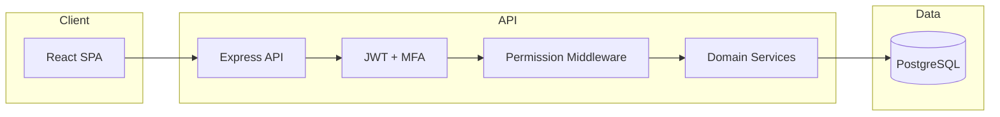

# Arquitetura MSU

## Visão geral



## Camadas

### Frontend (`src/`)

- **Pages**: ecrãs por domínio (clientes, créditos, relatórios…)
- **lib/**: cliente API, autenticação, permissões (UI)
- **components/ui/**: design system (Radix + Tailwind)

### Backend (`backend/src/`)

| Pasta | Responsabilidade |
|-------|------------------|
| `routes/` | HTTP handlers; delegam lógica pesada a services |
| `middleware/` | Auth JWT, permissões, validação Zod |
| `services/` | Regras de negócio reutilizáveis |
| `db/` | Migrações versionadas (`schema_migrations`) |
| `validators/` | Schemas de entrada |

### Partilhado (`shared/`)

- `permissions.mjs` — fonte única do catálogo de permissões e defaults por role

## Multi-tenant

- Cada registo de negócio tem `company_id`
- Admin central opera com header `x-company-id`
- `resolveCompanyScope()` em `middleware/auth.js`

## Migrações

1. Ficheiros SQL em `backend/src/db/migrations/` (ordenados por prefixo)
2. Tabela `schema_migrations` regista versões aplicadas
3. Bases legadas são detetadas automaticamente e marcadas como migradas

Para exportar schema de uma BD existente:

```bash
node backend/scripts/introspect-schema.js
```

## Próximos passos de refactor

- Dividir `loan-routes.js` em sub-routers em `routes/loans/`
- Extrair hooks dos pages grandes do frontend
- Testes E2E nos fluxos críticos (login, desembolso, reembolso)
